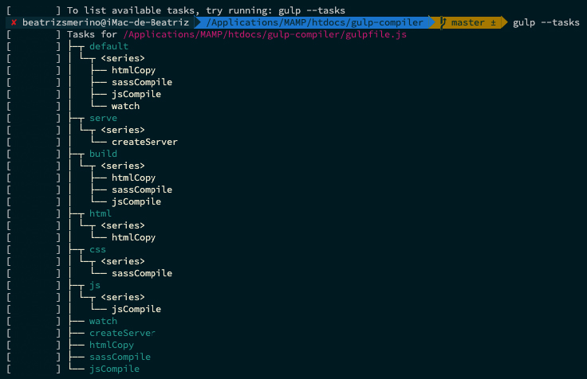

# Gulp compiler

Gulp Compiler is a basic code for automate the tasks of your development environment with the task runner `Gulp`.
This project has functions for create a **server**, **copy and paste** folders/files, **compile** and **compress** files and **watch** his changes.


## Development interface

Is developed with [gulp](https://gulpjs.com/) 4.0.0 a task runner and javascript.

`Gulp` is a toolkit for automating painful or time-consuming tasks in your development workflow, so you can stop messing around and build something.

More information: [Introduction to gulp](https://dolphinandmermaids.com/blog/gulp-examples)

## Content


The `SASS` and `JS` compilation tasks pick up the files in the `src` folder and generate a new `dist` folder with the results.

- Input structure folders

    ```shell
    src/
        sass/
            styles.sass
        js/
            scripts.js
        index.html
    ```

- Output structure folders

    ```shell
    dist/
        css/
            styles.min.css
        js/
            scripts.min.js
        index.html
    ```

## First steps


> You can skip this section if you already have NODE, NPM and GULP.

### Installs the necessary

1. Install [Node](https://nodejs.org/es/) and [NPM](https://docs.npmjs.com/)

    - If you are on MAC you can do it with line of following these steps

        - First, install [Homebrew](https://brew.sh/index_es)

        ```shell
        /bin/bash -c "$(curl -fsSL https://raw.githubusercontent.com/Homebrew/install/HEAD/install.sh)"
        ```

        - Next, install Node (npm will be installed with Node):

        ```shell
        brew install node
        ```

    - Or install node and npm together with this program: [Download](https://www.npmjs.com/get-npm)

2. Install [Gulp 4.0.0](https://gulpjs.com/)

    - Install gulp globally

        ```shell
        npm install --global gulp-cli
        ```

    - Install gulp inside project

        ```shell
        npm install gulp
        ```

### Check the packages installed

1. To test out your `NODE`, `NPM` and `GULP`, check versions installed

    - Check version of node

        ```shell
        node --version
        ```

    - Check version of npm

        ```shell
        npm --version
        ```

    - Check version gulp

        ```shell
        gulp --version
        ```

2. Check the globally installed packages

    ```shell
    npm list -g --depth=0
    ```

## How use



### If you already have node, npm and gulp

1. After installing everything you need, cloning this repository.

    ```shell
    git clone https://github.com/beatrizsmerino/gulp-compiler.git
    ```

2. For end, you must launch this command, for download the NPM packages and get the dependencies of configuration file [package.json](package.json).

    ```shell
    npm install
    ```

### Gulp tasks availables

- You can to list available the gulp tasks of this project, using the command

    ```shell
    gulp --tasks
    ```

## NPM


### Project setup

After cloning this repository you need to install the required NPM packages.

```shell
npm install
```

### Deploy

After development you can publish the content of `dist` folder in Github Pages (`gh-pages` branch)

```shell
npm run deploy
```

## GULP


In the [gulpfile.js](gulpfile.js) of this proyect you can see the **gulp tasks** developed to compile and compress the `SASS` and `JS`, copy and paste the `HTML` files, create a server and listen to the changes made to reload it ([Browsersync + Gulp.js](https://browsersync.io/docs/gulp))

This version use `gulp.series()`, combines task functions and/or composed operations into larger operations that will be executed one after another, in sequential order.

### 🔧 Run server and watch changes

This is the default gulp task

This command is able to:

1. Creates the `dist` folder if it does not exist.
2. Generate `html`, `css`, `js` on `dist` folder.
3. Watch the changes to the files in the `sass`, and `js` folders inside the `src` folder.
4. Create a server and reloads if there are any changes in those files of `dist` folder.

```shell
gulp
```

or

```shell
gulp htmlCopy
gulp htmlMinify
gulp sassCompile
gulp jsCompile
gulp watch
```

### 💻 Run server

This create a static server with browserSync package, serves the files from `dist` folder and opens by default the `index.html` file in any of these browsers: Chrome & Firefox.

```shell
gulp serve
```

or

```shell
gulp createServer
```

### 📂 Generate html, css and js

This command is able to:

1. Creates the `dist` folder if it does not exist.
2. Generate `html`, `css`, `js` on `dist` folder.

```shell
gulp build
```

or

```shell
gulp htmlCopy
gulp htmlMinify
gulp sassCompile
gulp jsCompile
```

### 📄 Generate html

This command is able to:

1. Creates the `dist` folder if it does not exist.
2. Copies the `html` files from the `src` folder and pastes the `dist` folder.
3. Minify the `html` files. Collapse white space that contributes to text nodes in a document tree.

```shell
gulp html
```

or

```shell
gulp htmlCopy
gulp htmlMinify
```

### 📄 Generate css

This command is able to:

1. Creates the `dist` folder if it does not exist.
2. Compile the `styles.sass` file (with the import files of partials sass) located at `src/sass/`, add prefixes to properties css, compress the file, create and add a mapping for the debugger styles sass on the browser inspector, apply a Gulp Plugin for Line Ending Corrector (A utility that makes sure your files have consistent line endings)...
3. Create the `styles.min.css` file and export to `dist/css/` folder.

```shell
gulp css
```

or

```shell
gulp sassCompile
```

### 📄 Generate js

This command is able to:

1. Creates the `dist` folder if it does not exist.
2. Get list of files of `pathsFront` object, compile the files with Babel NPM package, compress it and apply a Gulp Plugin for Line Ending Corrector (A utility that makes sure your files have consistent line endings)...
3. Export the `scripts.min.js` file to `dist/js` folder.

```shell
gulp js
```

or

```shell
gulp jsCompile
```

### 🔎 Watch changes

This command is able to:

1. Create the server.
2. Watch the changes to the files in the `html`, `sass` and `js` folders inside the `src` folder and run the tasks to re-generate the files inside the `dist` folder.
3. Reloads the server if there are any changes to the `html`, `css` and `js` files inside the `dist` folder.

```shell
gulp watch
```

## 🚀 Another version

There is a more complete version in the branch `feature/gulpfile-front-back`. [Go there](https://github.com/beatrizsmerino/gulp-compiler/tree/feature/gulpfile-front-back)

- This version separate the frontend and backend.
- It has more tasks as minify images and icons.
